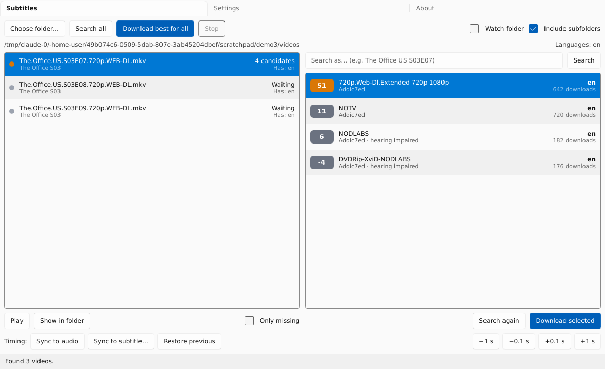
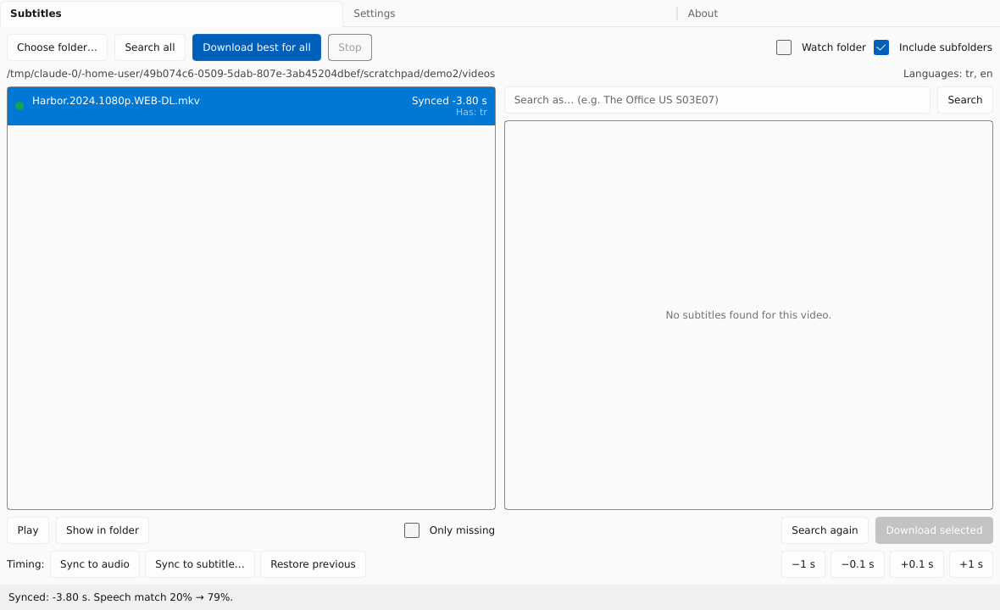

# SubMagician

Finds subtitles for a whole folder of videos, picks the one made for **your** file, fixes the
encoding and the timing, and saves it next to the video. Windows and Linux (macOS later).

[Türkçe](README.tr.md)



## Why

- A hash match is not always right, and a name search gives you dozens of releases to guess from.
  SubMagician scores every candidate: hash match, release group, source (BluRay/WEB), streaming
  service, resolution, name similarity, wrong episodes rejected.
- Broken Turkish characters (Windows-1254) are fixed; everything is saved as UTF-8.
- Timing is fixed from the video's audio: offset, frame rate (23.976 / 24 / 25) and cut or added
  scenes. If the subtitle already fits, it is left alone. You can also sync to another subtitle
  that is in sync, or nudge it by ±0.1 s / ±1 s.
- Sources: OpenSubtitles, SubDL and Addic7ed (TV series, through Gestdown); each can be switched
  off. Results are cached for a few days. RAR and 7z archives are opened with bsdtar / 7-Zip
  (Windows 10+ has `tar.exe` built in).

## Use

1. **Choose folder…**, drop a folder on the window, or right-click a folder in your file manager
   → *Find subtitles with SubMagician* (Settings → File manager adds that entry).
2. **Download best for all**, or click a video to see ranked candidates and download one.
   A wrongly named file can be searched under another name with **Search as…**.
3. The subtitle is saved as `Movie.tr.srt` next to `Movie.mkv`; players load it on their own.
   The file it replaced is kept, **Restore previous** puts it back.
4. With **ffmpeg** installed it is synced to the audio right after the download (Settings →
   Timing), or click **Sync to audio** for a subtitle you already have.



More:

- Videos that already carry the wanted language inside (an MKV subtitle track) are skipped.
- **Watch folder**: new videos dropped into the folder get their subtitle on their own, once
  they have finished copying.
- **Only missing** hides the videos that are done; **Play** and **Show in folder** are under the
  list.

Settings: wanted languages in order (`tr, en`), sources, optional OpenSubtitles login for a
higher daily download limit, ffmpeg path.

## Command line

`submagician-cli` does the same for scripts, using the app's settings:

```sh
submagician-cli ~/Videos                      # best subtitle + sync for every video
submagician-cli -l tr,en --dry-run Film.mkv   # show what it would pick
submagician-cli --sources addic7ed --no-sync ~/Shows/The.Office
```

`submagician <folder or video>` opens the app on that folder.

## Build

Rust 1.88+ and a C compiler. On Linux: `libfontconfig1-dev libxkbcommon-dev`. For syncing and
embedded tracks: `ffmpeg` and `ffprobe` on PATH or next to the program.

```sh
SUBMAGICIAN_OPENSUBTITLES_API_KEY=… SUBMAGICIAN_SUBDL_API_KEY=… \
  cargo build --release -p submagician -p submagician-cli
```

See `docs/PLAN.md` for the roadmap. License: AGPL-3.0.
