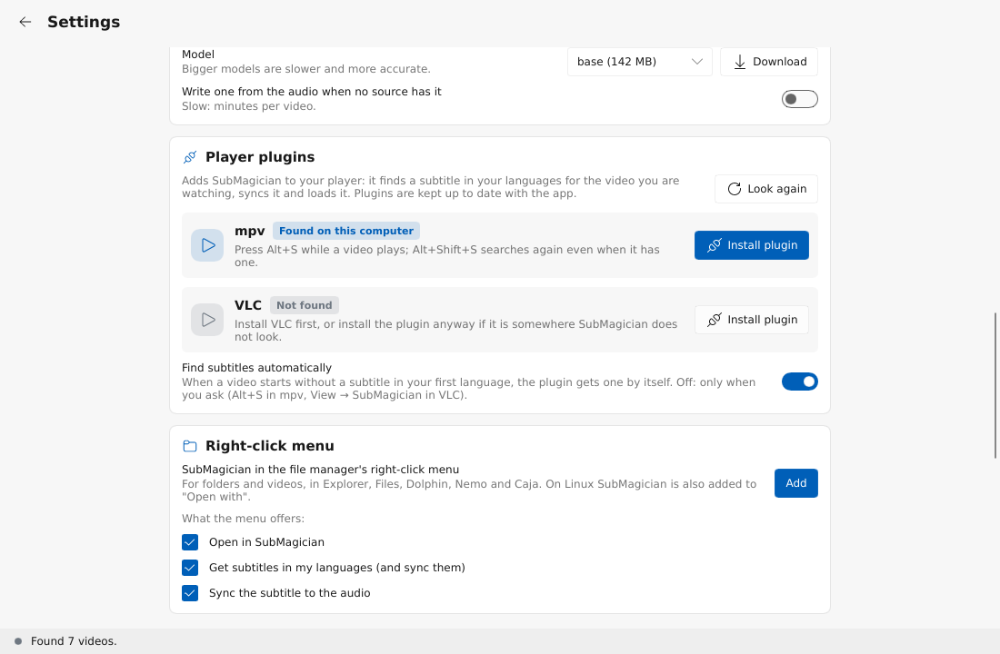

# SubMagician

Bir klasördeki tüm videolar için altyazı bulur, **senin** dosyan için hazırlanmış olanı seçer,
kodlamasını ve zamanlamasını düzeltir ve videonun yanına kaydeder. Windows ve Linux (macOS sonra).

[English](README.md)


## İndir

[Web sitesinden](https://halilkhrmn.github.io/submagician/) ya da
[sürümler sayfasından](https://github.com/halilkhrmn/submagician/releases):

- **Windows**: `submagician-setup-….exe` (yönetici izni gerekmez, ffmpeg dahil) ya da taşınabilir
  zip.
- **Linux**: `SubMagician-…-x86_64.AppImage` (çalıştırılabilir yapıp aç) ya da Debian/Ubuntu için
  `.deb` (`sudo apt install ./submagician_….deb`).

Kurulum dosyası ve AppImage kendini günceller: yeni sürüm çıkınca SubMagician haber verir,
güncellemeden sonra neyin yeni olduğunu gösterir.

## Neden

- Hash eşleşmesi her zaman doğru değil, isimle arayınca da onlarca sürüm arasından tahmin
  etmek gerekiyor. SubMagician her adayı puanlar: hash eşleşmesi, release grubu, kaynak
  (BluRay/WEB), yayın servisi, çözünürlük, isim benzerliği; yanlış bölümler elenir.
- Bozuk Türkçe karakterler (Windows-1254) düzeltilir; her şey UTF-8 olarak kaydedilir.
- Zamanlama videonun sesinden saniyeler içinde düzeltilir: kayma, kare hızı (23.976 / 24 / 25)
  ve kesilmiş ya da eklenmiş sahneler. Altyazı zaten uyuyorsa dokunulmaz.
- Kaynaklar: OpenSubtitles, SubDL ve Addic7ed (diziler, Gestdown üzerinden); her biri
  kapatılabilir. Sonuçlar birkaç gün önbellekte tutulur. RAR ve 7z arşivleri bsdtar / 7-Zip ile
  açılır (Windows 10+ içinde `tar.exe` hazır gelir).

## Kullanım

1. **Choose folder…** ya da **Open videos…**, pencereye sürükleyip bırak ya da dosya
   yöneticisinde bir klasöre veya videoya sağ tıkla (Settings → Right-click menu SubMagician'ı
   oraya ekler ve girişlerini seçtirir: SubMagician'da aç, altyazı getir, altyazıyı sese
   senkronla).
2. **Get subtitles for all**, ya da bir videoya tıkla: sağdaki panel altyazılarını bayrak olarak
   ve kaynakların sunduklarını en iyisi üstte gösterir; her biri **Exact** (tam bu dosya için
   yapılmış), **Good**, **Fair** ya da **Weak** diye işaretlidir. **Search as…** yanlış
   adlandırılmış bir dosyayı başka bir adla arar.
3. Altyazı `Film.mkv`'nin yanına `Film.tr.srt` olarak kaydedilir; oynatıcılar kendiliğinden
   yükler. Hemen sese senkronlanır. Yerine geçtiği dosya saklanır: *Sync to audio*'nun yanındaki
   geri alma düğmesi onu geri koyar.


Dahası:

- **Hızlı senkron**: SubMagician önce filmin her yerinden birkaç kısa parçayı aynı anda dinler;
  yanlış kayma ya da kare hızı için bu yeter (bir iki saniye). Sahne kesilmiş ya da eklenmişse
  bütün sesi okur, her işlemci çekirdeğine bir parça. Duyduğunu hatırlar, aynı videoyu yeniden
  senkronlamak anında olur. *Sync to audio* her altyazıda çalışır; *Copy timing…* senkron olan
  başka bir altyazıyı kullanır; ±0,1 s / ±1 s elle kaydırır.
- **Videonun içindeki altyazılar** (MKV/MP4 parçaları): **Use the subtitle inside** senin
  dilindekini dosya olarak kaydeder ve sese senkronlar. Resim parçaları (Blu-ray, DVD) metin
  olarak kullanılamaz.
- Ağır işler (senkron, sesten yazma) ayrı bir süreçte çalışır: pencere hiç donmaz, her video
  ilerlemesini gösterir, **Stop** hemen bitirir.
- **Açık klasörü izleme** (Settings → Library): klasöre gelen yeni videolar kopyalanması bitince
  altyazısını kendisi alır. **Only videos without a subtitle** işi biten videoları gizler.
- **Write from speech** (Whisper, bu bilgisayarda): hiçbir kaynakta altyazı yoksa konuşmadan yazılır.
  İlk seferde konuşma modelini indirmeyi önerir; Settings → Speech başka bir model seçer,
  otomatik de çalışabilir. İngilizceye her dilden
  çevirir; diğer diller konuşulduğu gibi yazılır.

### Oynatıcı eklentileri

**Settings → Player plugins** bilgisayarındaki mpv'yi (ve mpv.net'i) ve VLC'yi bulur,
SubMagician'ı tek tıkla içlerine kurar. Sonra:

- **mpv**: senin dilinde altyazısı olmayan bir video kendiliğinden altyazı alır; **Alt+S** altyazı
  ister, **Alt+Shift+S** yeniden arar.
- **VLC**: *Görünüm (View) → SubMagician* oynayan video için altyazı bulur, açık kaldığı sürece
  başlayan her video için de.

Eklentiler SubMagician'ın ayarlarını kullanır: dillerin, kaynakların, senkron ve Whisper.
Flatpak ya da Snap'ten kurulan oynatıcılar korumalı alanda çalıştığı için eklentiyi kullanamaz.



### Ayarlar

Sırayla diller (`tr, en`), kaynaklar, günlük indirme sınırını yükseltmek için isteğe bağlı
OpenSubtitles girişi, senkron ve ffmpeg, Whisper, güncellemeler, kayıtlar. **Logs and
problems**: uyarılar ve hatalar her zaman `errors.log`'a yazılır; *Save detailed logs* bir süre
her adımı kaydeder; **Report a problem** ne gönderileceğini aynen gösterir, sonra bir GitHub
issue'su ya da e-posta açar.

## Komut satırı

`submagician-cli` aynı işi betikler için yapar, uygulamanın ayarlarını kullanır:

```sh
submagician-cli ~/Videos                      # her video için en iyi altyazı + senkron
submagician-cli -l tr,en --dry-run Film.mkv   # neyi seçeceğini göster
submagician-cli --from-video ~/Videos         # videoların içindeki altyazıları kullan, senkronla
submagician-cli --sources addic7ed --no-sync ~/Shows/The.Office
submagician-cli --download-model base && submagician-cli --generate ~/Videos
```

`submagician <klasör ya da video>` uygulamayı o klasörde açar. AppImage'dan:
`SubMagician-….AppImage --cli …`.

## Derleme

Rust 1.88+, bir C/C++ derleyicisi ve CMake. Linux'ta: `libfontconfig1-dev libxkbcommon-dev`. Senkron ve
gömülü parçalar için: PATH'te ya da programın yanında `ffmpeg` ve `ffprobe`.

```sh
SUBMAGICIAN_OPENSUBTITLES_API_KEY=… SUBMAGICIAN_SUBDL_API_KEY=… \
  cargo build --release -p submagician -p submagician-cli
```

Paketler: `docs/RELEASING.md`. Yol haritası: `docs/PLAN.md`. Lisans: AGPL-3.0.
