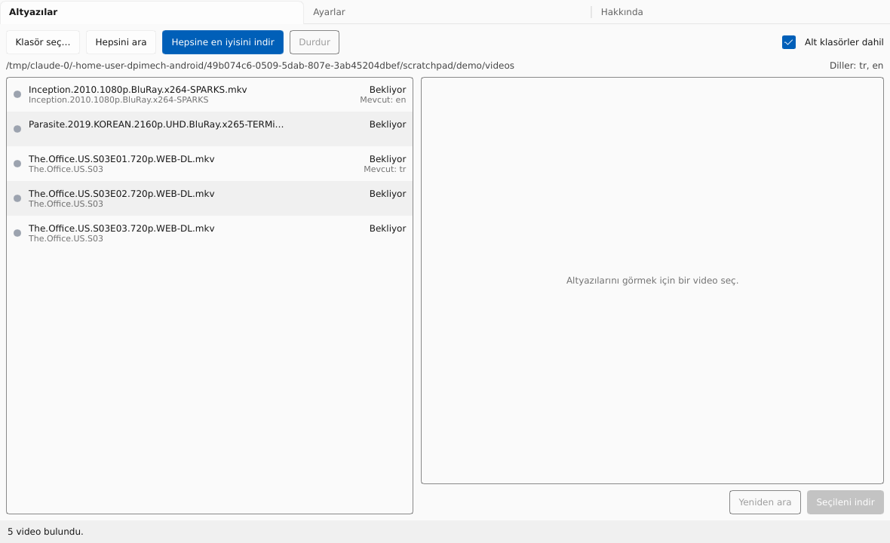

# SubMagician

Bir klasördeki tüm videolar için altyazı bulur, **senin** dosyan için hazırlanmış olanı seçer,
kodlamasını düzeltir ve videonun yanına kaydeder. Windows ve Linux (macOS sonra).

[English](README.md)



## Neden

- Hash eşleşmesi her zaman doğru değil, isimle arayınca da onlarca sürüm arasından tahmin
  etmek gerekiyor. SubMagician her adayı puanlar: hash eşleşmesi, release grubu, kaynak
  (BluRay/WEB), yayın servisi, çözünürlük, isim benzerliği; yanlış bölümler elenir.
- Bozuk Türkçe karakterler (Windows-1254) düzeltilir; her şey UTF-8 olarak kaydedilir.
- Sırada: sesten otomatik senkron (alass), daha fazla kaynak, Whisper.

## Kullanım

1. **Klasör seç…**: klasördeki (ve alt klasörlerdeki) videolar, mevcut altyazılarıyla listelenir.
2. **Hepsine en iyisini indir** ya da bir videoya tıklayıp puanlı adaylardan birini indir.
3. Altyazı `Film.mkv` dosyasının yanına `Film.tr.srt` olarak kaydedilir; oynatıcılar kendisi açar.

Ayarlar: istenen diller sırayla (`tr, en`), daha yüksek günlük indirme sınırı için isteğe bağlı
OpenSubtitles girişi, arayüz dili.

## Derleme

Rust 1.88+. Linux'ta: `libfontconfig1-dev libxkbcommon-dev`.

```sh
SUBMAGICIAN_OPENSUBTITLES_API_KEY=uygulama-anahtari cargo build --release -p submagician
```

Yol haritası için `docs/PLAN.md`. Lisans: AGPL-3.0.
