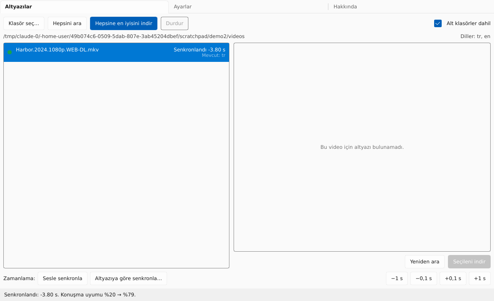

# SubMagician

Bir klasördeki tüm videolar için altyazı bulur, **senin** dosyan için hazırlanmış olanı seçer,
kodlamasını düzeltir ve videonun yanına kaydeder. Windows ve Linux (macOS sonra).

[English](README.md)


## Neden

- Hash eşleşmesi her zaman doğru değil, isimle arayınca da onlarca sürüm arasından tahmin
  etmek gerekiyor. SubMagician her adayı puanlar: hash eşleşmesi, release grubu, kaynak
  (BluRay/WEB), yayın servisi, çözünürlük, isim benzerliği; yanlış bölümler elenir.
- Bozuk Türkçe karakterler (Windows-1254) düzeltilir; her şey UTF-8 olarak kaydedilir.
- Zamanlama videonun sesinden düzeltilir: kayma, kare hızı (23.976 / 24 / 25) ve kesilmiş ya
  da eklenmiş sahneler. Altyazı zaten uyuyorsa dokunulmaz. Senkron olan başka bir altyazıya göre
  de senkronlayabilir ya da ±0,1 s / ±1 s kaydırabilirsin.
- Kaynaklar: OpenSubtitles, SubDL, Podnapisi ve Addic7ed (diziler, Gestdown üzerinden); her biri
  kapatılabilir. Sonuçlar birkaç gün önbellekte tutulur. RAR ve 7z arşivleri bsdtar / 7-Zip ile
  açılır (Windows 10+ içinde `tar.exe` hazır gelir).
- Sırada: klasör izleme, gömülü altyazı izleri, Whisper.

## Kullanım

1. **Klasör seç…**: klasördeki (ve alt klasörlerdeki) videolar, mevcut altyazılarıyla listelenir.
2. **Hepsine en iyisini indir** ya da bir videoya tıklayıp puanlı adaylardan birini indir.
3. Altyazı `Film.mkv` dosyasının yanına `Film.tr.srt` olarak kaydedilir; oynatıcılar kendisi açar.
4. **ffmpeg** kuruluysa indirmeden hemen sonra sese göre senkronlanır (Ayarlar → Zamanlama);
   zaten olan bir altyazı için **Sesle senkronla**'ya tıkla.



Ayarlar: istenen diller sırayla (`tr, en`), daha yüksek günlük indirme sınırı için isteğe bağlı
OpenSubtitles girişi, arayüz dili.

## Derleme

Rust 1.88+ ve bir C derleyicisi. Linux'ta: `libfontconfig1-dev libxkbcommon-dev`. Senkron için:
PATH'te ya da programın yanında `ffmpeg`.

```sh
SUBMAGICIAN_OPENSUBTITLES_API_KEY=uygulama-anahtari cargo build --release -p submagician
```

Yol haritası için `docs/PLAN.md`. Lisans: AGPL-3.0.
